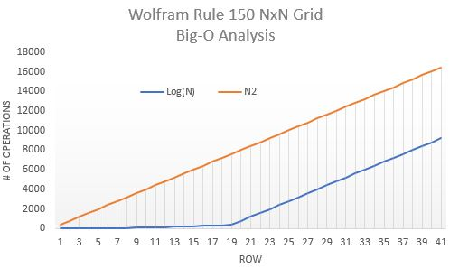

# Wolfram Rule 150 Demo
An interactive web visualization of Wolfram's Rule-150 (from his 2002 book "A New Kind of Science") utilizing HTML, Javascript, and P5.js.

## Class Number
California State University Fullerton 
CPSC 335-02 
Algorithm Engineering

## Project Number and Name
No.: 1 
Name: Wolfram Rule 150 Demo 

## Team Name and Members
Team Name: WolframSolo 
Members:
* David Nguyen

## Intro
Wolfram Rule 150 is one of the many elementary cellular automata rules introduced by Stephen Wolfram back in 1983. The following solution has a **Big-O of O(N^2)** because it is traversing cell-by-cell row-by-row. However, if we assume there will always be a single starting point, we could utilize an algorithm that traverses row-by-row, peeking 2N+1 cells each row. This would turn our solution into a **Big-O of O(Log(N))**, but eventually plateauing into **O(N^2)** again due to the limitation of the size of the grid in a worst-case scenario.

## Contents
img/BigO.JPG - BigO Analysis Chart of O(Log(N)) vs O(N^2) Solutions 
img/GitHub-Mark-32px.png - GitHub Logo 
img/LinkedIn-Bug-32px.png - LinkedIn Logo 
img/Rule150Icons.gif - Wolfram Rule 150 Ruleset Icons 
static/css/styles.css - Stylesheet 
static/js/cs-sketch.js - Renders Wolfram Rule 150 
static/js/draw_stuff.js - Draws a grid (only works if bg is set to white) 
static/js/p5.js - p5.js library for drawing 
index.html - index page that holds the Wolfram Rule 150 demo 
README.md - What you're currently reading. 
README.txt - Plain ASCII of what you're currently reading. 

## External Requirements
None

## Setup and Installation
Run index.html on a local server or open in browser. 
You may also visit https://david-kishi.github.io/wolfram-rule-150-demo/

## Sample invocation
N/A

## Features
- Press any button to resume/pause
- ***(Missing)*** O(Log(N)) solution
- ***(Missing)*** Helper layer highlighting peeked cells

## Bugs
- Helper layer highlighting peeked cells doesn't work well. p5 just doesn't work well with it or I'm just not doing it correctly.
- 401x401 grid that was asked as a requirement is way too big for a sequential searching algorithm. Scaled down to 41x41. Could implement async functions for parallelization for faster processing.
- 401x401 grid doesn't fit on any browsers unless you zoom out of normal zoom percentages.

## Contact
David Nguyen - david@knytes.com
